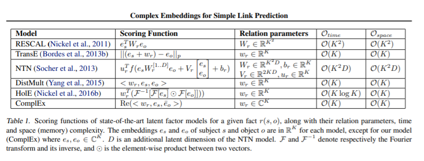
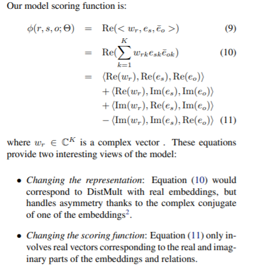
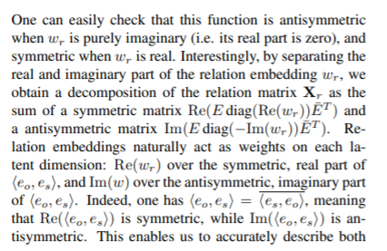

**Notes about my paper reading**

### Abstract

It proposes to solve link prediction through latent factorization. It makes use of complex valued embeddings, and it can handle symmetric and antisymmetric relations.

### Introduction

Link prediction is one of the main problem in Statistical Relational Learning(SRL).

Recently, a popular method is to state link prediction task as a 3D binary tensor completion problem, where each slice is the adjacency matrix of one relation type in the KG.

Original dot product can easily capture symmetry pattern but antisymmetry pattern is hard. But using complex embedding, it will receive different scores depending on the ordering of the entities involved.

### Relations as Real Part of Low-Rank Normal Matrices

Let $|\varepsilon|=n$. A relation between 2 entities  is represented as a binary value $Y_{so}=\{-1,1\}$. $P(Y_{so}=1)=\sigma(X_{so})$ , where $X\in R^{n*n}$ is a latent matrix of scores and $Y$ the partially observed sign matrix.

**The goal is to find a generic structure for $X$ that leads to a flexiable approximation of common relations in real world KBs.** 

Standard matrix factorization approximates $X$ by a matrix product $UV^T$ , where $U$ and $V$ are two functionally independent $n × K$ matrices, $K$ being the rank of the matrix($X$ is relation matrix, and we use $U$ and $V$ to represent the entity embedding, $K$ is the embedding dimension). Within this formulation it is assumed that entities appearing as subjects are different from entities appearing as objects.  Because the same entity, if it is subject, its embedding is from $U$, but if it is object, its embedding is from $V$.

problem: In link prediction problem, the same entity can appear as both subject and object. It then seems natural to learn joint embeddings of the entities, which entails sharing the embeddings of the left and right factors.

If the relation is symmetric, $X=EWE^{-1}$ by using Eigenvalue decomposition, all eigenvalues and eigenvectors live in the real space, and $E$ is orthogonal($E^T=E^{-1}$). This paper works on if the relation is antisymmetric, so it uses complex number($Re(x)$ and $Im(x)$), the dot product(**Hermitian product**): $<u,v>=\overline{u}^Tv$($\overline{u}=Re(u)-iIm(u)$).

Considering normal matrices($X:n×n$, $X\overline{X}^T=\overline{X}^TX$), the spectral theorem for normal matrices states that a matrix $X$ is normal if and only if it is unitarily diagonalizable: $X=EW\overline{E}^T$. 

By using this decomposition, in order to use $P(Y_{so})=1$, it only keep the real part: $X=Re(EW\overline{E}^T)$.

#### Low-Rank Decomposition

There are many beautiful theory in this, you can find in the corresponding section in the paper.

---

contributions:

1. The factorization encompasses all possible binary relations.

2. By construction, it accurately describes both symmetric and antisymmetric relations.

3. Learnable relations can be efficiently approximated by a simple low-rank factorization, using complex numbers to represent the latent factors.

model:

theory:

### Experiments

DistMult is not able to model antisymmetry and only predicts the symmetric relations correctly.

The number of negatives generated per positive training sample has influence.

