**Notes about my paper reading**

### Abstract

CF( collaborative filtering) has the sparsity of user-item interactions and cold start problem, so much work has done by using side information. This paper use KG to enhance the performance. From the author's survey,  knowledge-graph-aware recommendation can be divided into embedding-based and path-based. This paper proposes **RippleNet** which stimulates the propagation of user preferences over the set of knowledge entities by automatically and iteratively extending a user’s potential interests along links in the knowledge graph, just like actual ripples propagating on the water. And similar to interference phenomenon in physics, the multiple "ripples" activated by a user’s historically clicked items are thus superposed to form the preference distribution of the user with respect to a candidate item.

### Introduction

KG can benefit the recommendation from 3 aspects: (1) KG introduces semantic relatedness among items; (2) The relations in KG are various which help extend a user's interests reasonably and  increase the diversity of recommended items; (3) KG connects historical records and the recommended ones, thereby makes the system **explainable**.

Embedding-based methods: pre-pocess a KG with KGE, such as DKN(Deep-Knowledge-aware Network), CKE(Collaborative Knowledge base Embedding), SHINE(Signed Heterogeneous Information Network Embedding).

Path-based methods: explore various patterns of connections among items in KG to provide additional guidance for recommendations, such as PER(Personalized Entity Recommendation), 

Meta-Graph Based Recommendation.

RippleNet is an end-to-end framework which is design for click-through rate(CTR), it means that the input is a user-item pair and the output is a probability.

**The key idea is perference propagation: **the historical items are as a seed set, and similar to raindrops propagate on the water, it will extends the user’s interests iteratively along KG links to discover  hierarchical potential interests with respect to a candidate item.

**Pros:** (1) Incorporate KGE into RS; (2) Automatically discover possible paths from a historical item to a candidate item; (3) Provide a new perspective of explainability for the recommended results in terms of the knowledge graph.

### Problem formulation

Users: $U=\{u_1,u_2,...\}$, items: $V=\{v_1,v_2,...\}$, user-item interaction matrix: $Y=\{y_{uv}|u\in U, v\in V\}$. If interaction $(u,v)$ is observed, $y_{uv}=1$; otherwise, $y_{uv}=0$. 

Our goal: learn a prediction function $\hat{y_{uv}}=F(u,v;\theta)$, where $\hat{y_{uv}}$ denotes the probability that user $u$ will click item $v$, and $\theta$ denotes the model parameters of function $F$. $\theta$ includes the embeddings of all entities, relations and items.

### RippleNet

#### Framework

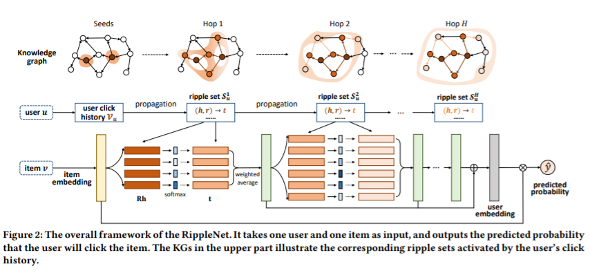

input: a user $u$ and an item $v$.

output: the predicted probability that user $u$ will click item $v$.

#### Ripple Set

1. Relevant Entity(k-hop relevant entities)

   $\varepsilon_{u}^{k}=\{t|(h,r,t)\in G \  and\  h \in \varepsilon_u^{k-1}\},k = 1,2,...,H.$

   $\varepsilon_u^{0}=V_u=\{u|y_{uv}=1\}$.

2. Ripple Set(k-hop ripple set)

   $S_u^{k}=\{(h,r,t)|(h,r,t)\in\ G \ and \ h \in \varepsilon_u^{k-1}\},k=1,2,...,H.$

   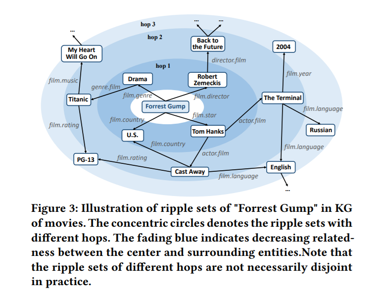

Concerns: Ripple sets sizes may get too large with the increase of hop number k. (1) Many entities in the real KG are sink entities(only have incoming linkes without outgoing links); (2) In specific recommendation scenearios, relations can be limited to scenario-related categories which helps reduce the size of ripple sets; (3) If hop number $H$ is too large, entities that are too distant from a user’s history may bring more noise than positive signals. (4) In RippleNet, it just **samples a fixed-size set** of neighbors instead of using a full ripple set. 

####  Preference Propagation

This paper proposes a preference propagation technique to explore users’ potential interests in his ripple sets, that means a user's representation is combined by his potential interesting items.

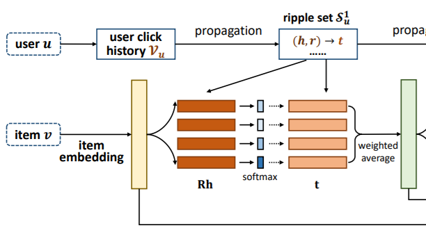

propagation steps:

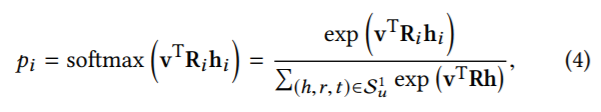

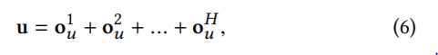

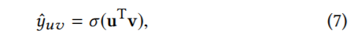

$v\in R^d,R_i\in R^{d*d},h_i \in R^d,t_i \in R^d$

concerns:  ***it is necessary to take the embedding matrix $R_i$ into consideration when calculating the relevance of item $v$ and entity $h_i$ , since an item-entity pair may have different similarities when measured by different relations.*** 

And though $o_u^{H}$ contains all the information from previous hops, it is still necessary to use Eq. (7) that some information may be diluted in $o_u^{H}$.

#### Learning Algorithm

RippleNet tries to $max \ p(\theta|G,Y)$ after observing the KG $G$ and the matrix of implicit feedback $Y$.

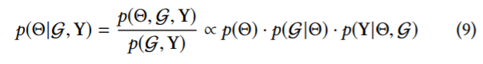

Set $p(\theta)$ as Gaussian distribution:

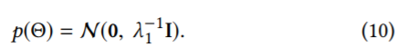

The second item in Eq. (9) is the likelihood function of the observed knowledge graph $G$ given $\theta$.

(KGE methods include translational distance models and semantic matching models. In RippleNet, it use a three-way tensor factorization method to define the likelihood function for KGE)

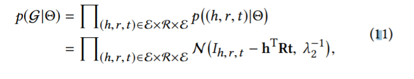

That $h^TRt$ means the probability of (h,r,t) is a true triplet. $I_{(h,r,t)}$ is the indicator of $(h,r,t)\in G\ or \ not$. If $I_{(h,r,t)}=1\ or \ 0$ and $h^TRt$ near $1\ or\ 0$ ,the probability is bigger.

The third item in Eq. (10) is  the product of Bernouli distributions.

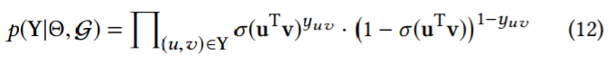

so loss function:

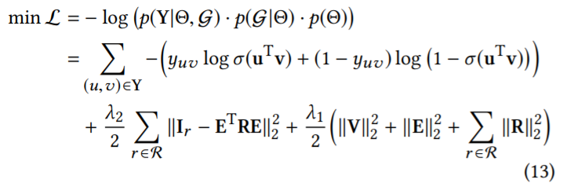

$V$ and $E$ are embeddings matrices of all items and entities. $I_r$  is the slice of the indicator tensor $I$ in KG for relation $r$. Because $\lambda_1$ and $\lambda_2$ are just scalars, so it is not strictly corresponding to the scalars of Gaussion distributions, but it doesn't matter.

The first item of Eq. (13) is cross-entropy loss between ground truth of interactions $Y$ and predicted value by RippleNet, the second term is squard error between the ground truth of the KG $I_r$ and the reconstructed indicator matrix $E^TRE$, the third term is the regularizer.

Algorithm:

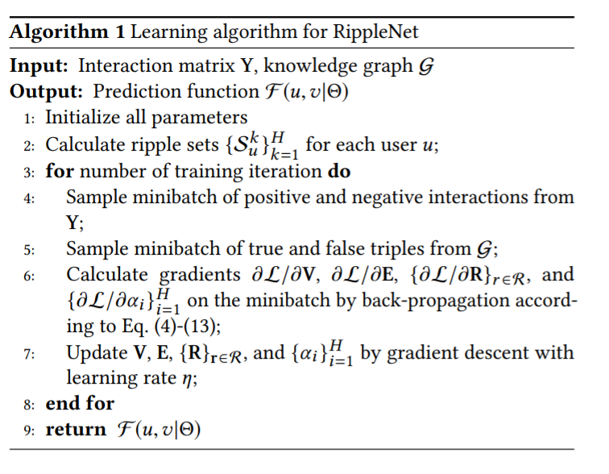

#### Discussion

1. Explainability

   RippleNet explores users’ interests based on the KG, it provides a new point of view of explainability by tracking the paths from a user’s history to an item with high relevance probability (Eq. (4)) in the KG.

2. Ripple Superposition

   An entity could be reached by multiple paths in the KG starting from a user’s click history, that means an entity may appear in different hop of ripple sets. This increases a user's interests in overlapped entities. This paper refers to the case as ripple superposition.

#### Links to Existing Work

KGE methods are mainly classified into two categories: (1) Translational distance models: TransE, TransH, TransD, TransR, exploit distance-based scoring functions when learning representations of entities and relations. (2) Semantic matching models: ANALOGY, ComplEx, DisMult, measure plausibility of knowledge triples by matching latent semantics of entities and relations.

### Experiments

#### Datasets

movie: MovieLens-1M

book: Book-Crossing dataset

news: Bing-News dataset

#### Empirical Study

1. The similarity of proximity structures of two items in the KG could assist in measuring their relatedness in RS.

2. The proximity structures of two items under the two circumstances become more similar with the increase of the hop number.

#### Results

##### Size of ripple set in each hop

With the increase of the size of ripple set, the performance of RippleNet is improved at first because a larger ripple set can encode more knowledge from the KG. Howerver, the performance drops when the size is too large.

##### Hop number

Too small of an H can hardly explore interentity relatedness and dependency of long distance, while too large of an H brings much more noises than useful signals.

#### Further Works

1.  Further investigate the methods of characterizing entity-relation interactions.
2.  Design non-uniform samplers during preference propagation to better explore users’ potential interests and improve the performance.