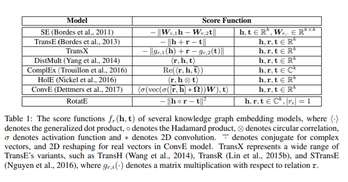
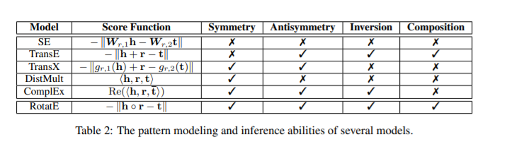
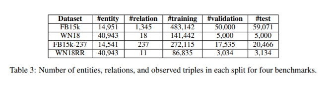
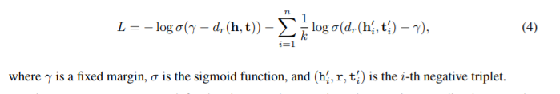
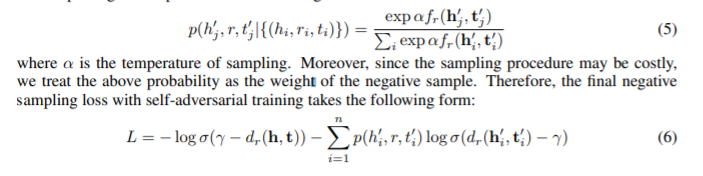

**Notes about my paper reading**

### Abstract

KGE relies heavily on the ability of modeling and inferring the patterns of the relations. RotatE is able to model and infer various relation patterns including: symmetry/antisymmetry, inversion, and composition. RotatE defines each relation as a rotation from the source entity to the target entity in complex vector space. Meanwhile, it proposes a novel self-adversarial negative sampling technique.

### Introduction

motivation:$e^{i\theta}=cos\theta + isin\theta$, which indicates that a unitary complex number can be regarded as a rotation in the complex plane. 

It expects that $t=h\circ r$, where $h,r,t\in C^k$, the modulus $|r_i|=1$ and $\circ$ denotes Hadmard product.

Three patterns:

symmetry/antisymmetry: $\forall x,y\   r(x,y)\Rightarrow r(y,x)\  (r(x,y)\Rightarrow \lnot r(y,x))$

inversion:$\forall x,y\   r_2(x,y)\Rightarrow r_1(y,x)$

composition: $\forall x,y,z\   r_2(x,y)\and r_3(y,z)\Rightarrow r_1(x,z)$

RotatE can model these three patterns. That means:

$r$ is symmetric $\Leftrightarrow$ each element of $r$ satisfies $r_i=\pm 1$

$r_1$ and $r_2$ are inverse $\Leftrightarrow$ $r_2=\overline{r}_1$

$r_3$ is combination of $r_1$ and $r_2$ $\Leftrightarrow$ $r_3=r_1 \circ r_2$($\theta_3=\theta_1+\theta_2$)

RotatE model is scalable to large KG as it remains linear in both time and memory. 

### Related work

Usually, KGE method is to define a score function for the triplets. The goal of the optimization is to score true triplet(h,r,t) higher than the corrupted false triplet(h',r,t) or (h,r,t'). Here are some score functions.

Many works model the relational paths on KG by using LSTM or something else, but RotatE model the relation patterns.

### RotatE

statistics of some datasets:

Negative sampling is proved effective for both learning KGE and word embedding.

It uses a loss function similar to the negative sampling loss for effectively optimizing distance-based models:

A uniform negative sampling suffers the problem of inefficiency since many samples are obviously false as training goes on, which does not provide meaningful information. It propose an approach called self-adversarial negative sampling, which samples negative triplets according to the current embedding model. More specific, it samples negative triplets from the following distribution:

### Experiment

#### Hyperparameter Settings

embedding dimension $k\in\{125,250,500,1000\}$

batch size $b\in \{512,1024,2048\}$

self-adversarial sampling temperature $\alpha\in\{0.5,1.0\}$

fixed margin $\gamma\in \{3,6,9,12,18,24,30\}$

#### Evaluation Settings

filtered setting: rank test triples against all other candidate triples not appearing in the training, validation or test set.

Mean Rank(MR), Mean Reciprocal Rank(MRR), Hits at N(H@N) are standard evaluation measures.

#### Baseline

RotatE makes embedding have modulus information and phase information.

It proposes a variant of RotatE as baseline where the modulus of embedding is also constrained: $|h_i|=|t_i|=C$

------

It shows that the modulus is very important for modeling the composition pattern.

### Conclution

1. RotatE

2. self-adversarial negative sampling technique and negative sampling loss

Further work: leverage a probabilistic framework to model the uncertainties of entities and relations