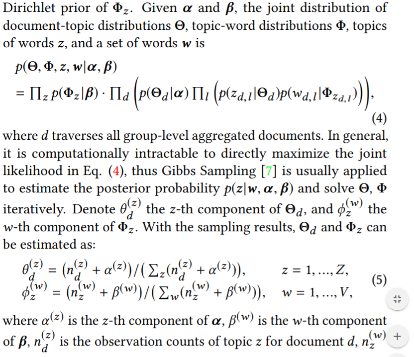
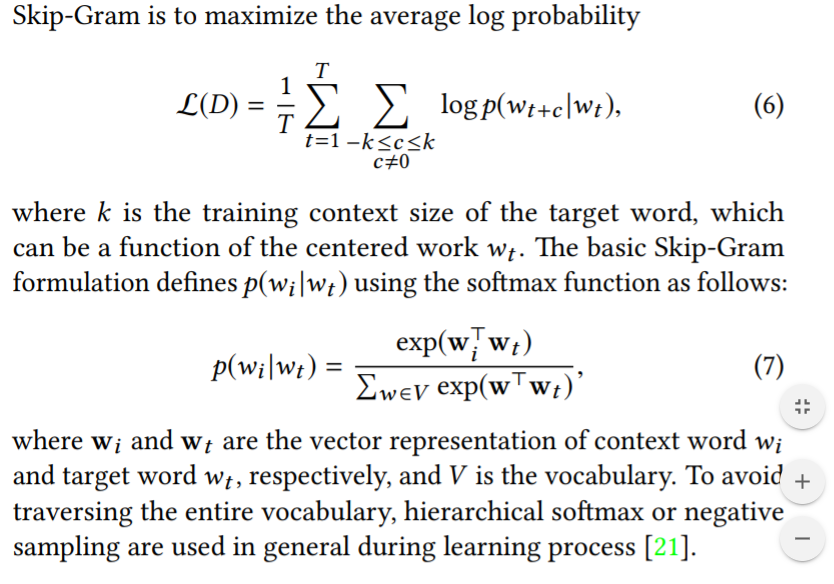
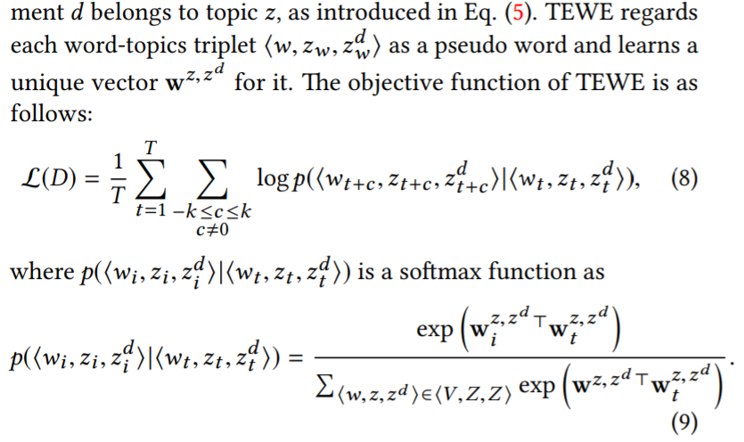
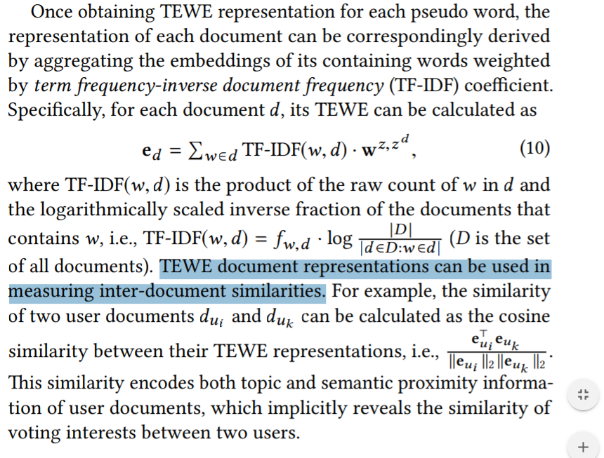
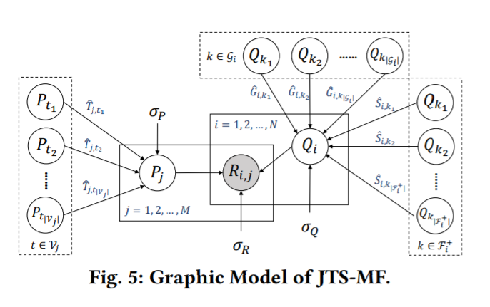
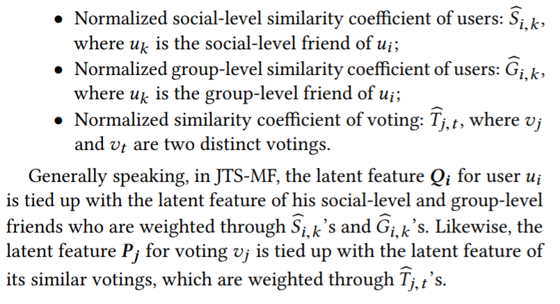
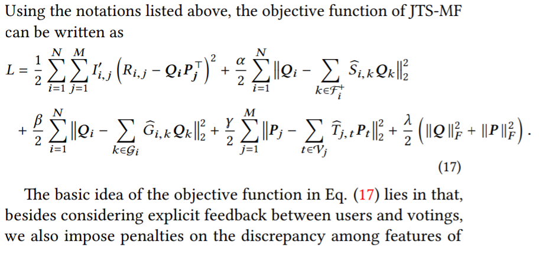

**Notes about my paper reading**

### Abstract

Online voting is an emerging feature in social networks. Online voting imposes new challenges on recommendation, and the propagation of votings heavily depends on the structure of social networks. **This paper utilizes 2 factors in a comprehensive manner when doing voting recommendation.** First,  it proposes a novel Topic-Enhanced Word Embedding (TEWE) method to learn word and document representation by jointly considering their topics and semantics. Second, it proposes  Joint Topic-Semantic-aware social Matrix Factorization (JTS-MF) model for voting recommendation. JTS-MF model calculates similarity among users and votings by combining their TEWE representation and structural information of social networks, and preserves this topic-semantic-social similarity during matrix factorization.

### Introduction

JTS-MF model considers social network structure and representation of voting content in a comprehensive manner. 

For social network structure, JTS-MF model fully encodes the information of social relationship and group affiliation into the objective function.

For representation of voting content, it proposes a Topic-Enhanced Word Embedding (TEWE) method to build a multi-prototype word and document representation, which jointly considers their topics and semantics.

The key idea of TEWE is to enable each word to have different representations under different word topics and different documents.

### Related Work

The author divides existing recommender systems into 3 classes: content-based(use user profiles or item descriptions as features for recommendation), collaborative filtering(use explicit feedback: [users' ratings on items] or implicit feedback: [users' browsing records about items] data of user-item interactions to find user preference), and hybrid methods(combine content-based and collaborative filtering models in many hybridization approaches).

Traditional recommender systems are vulnerable to data sparsity and cold-start problem.

### Background and data analysis

Statistics demonstrate that if 2 users are social-level or group-level friends, they are likely to participate more votings in common.

It is clear that if 2 users participated common voting, they are more likely to be social-level or group-level friends.

In the conclution, it proves that the strong correlation between voting behavior and social network structure, which motivates us to take users’ social relation and group affliation into consideration when making voting recommendation.

### Problem formulation

The set of all users: $U=\{u_1,u_2,...\}$; the set of all votings: $V=\{v_1,v_2,...\}$; the set of all groups: $G=\{G_1,G_2,...\}$. 

It models 3 types of relationship: user-voting, user-user, and user-group relationship:

Given the above sets of users and votings as well as three types of relationship, it aims to recommend a list of votings for each user, in which the votings are not participated by the user but may be interesting to him.

### Join-topic-semantic embedding

It learns the embeddings of users, votings, and groups in a joint topic and semantic way, and apply the embeddings to calculate similarities.

#### Topic distillation

LDA: each document $d$ is represented as a multinomial distribution $\theta_d$ over a set of topics, and each topic $z$ is represented as a multinomial distribution $\phi_z$ over a number of words.

Then, each word position $l$ in document $d$ is assigned a topic $z_{d,l}$ according $\theta_d$, and the word $w_{d,l}$ is generated according to $\phi_{z_{d,l}}$. 

By LDA, the topic distribution for each document and the topic assignment for each word can be obtained, which would be utilized later in the paper's proposed model.

Mark: each voting $v_j$ is a sentence of question, it can be regarded as document $d_{v_j}$. $d_{u_i}$is formed by aggregating documents of all its members, $d_{u_i}=\bigcup\{d_{v_j}|I_{u_i,v_j}=1\}$, and $d_{G_c}$ is formed by aggregating documents of all its members, $d_{G_c}=\bigcup\{d_{u_i}|I_{u_i,G_c}=1\}$.

The paper chooses to feed group-level aggregated documents $d_{G_c}$'s to LDA model as training samples as in $d_{u_i}$'s ans $d_{v_j}$'s, it may not extract the authentic topic distribution.

The formulation:

Then , it obtains the topic assignment for each word and topic distribution for each group.

#### Semantic distillation

Skip-Gram model is a well-known framework for word embedding, which finds word representation that are useful for predicting surrounding words in a document given a target word in a sliding window. Given a word sequence $D=\{w_1,w_2,...\}$, the objective function:

#### Topic-enhanced word embedding

TEWE(Topic-Enhanced Word Embedding), its basic idea: preserve topic information of documents and words when measuring the interaction between target word $w_t$ and context word $w_i$. 

Then, a word with different associated topics has different embeddings, and a word in documents with different topics has different embeddings, too.

TEWE jointly utilizes $z_w$ (the topic of the word in a document) and $z_{w}^d$ (the most likely topic of the document that the word belong to).

By using LDA, it obtains the topic of each word $z_w$ and topic distribution of each document $\theta_d$, so $z_w^d=argmax_z \theta_d^{(z)}$, ($\theta_d^{(z)}$ is the probability that document $d$ belongs to topic $z$)  

Compared to Skip-Gram, TEWE preserves word topic and document topic along with these words, sot it incorporates both topic and semantic information in embedding learning.

### Recommendation model

JTS-MF( Joint Topic-Semantic-aware Matrix Factorization), in which social relation ship, group affiliation, and topic-semantic similarities are combined.

It expects to keep inter-user and inter-voting topic-semantic similarities in latent feature space.

To this end, in JTS-MF model, while the rating $R_{i,j}$ is factorized as user latent feature $Q_i$ and voting latent feature $P_j$, it deliberately enforces $Q_i$ and $P_j$ to be dependent on their social-topic-semantic similar counterparts, respectively.

#### Similarity coefficients

Three similarity coefficients:

In section 6.1, you will find the details of these 3 coefficients.

#### Object function

The details of the different meanings of the 4 terms in the object function is lists in section 6.2.

