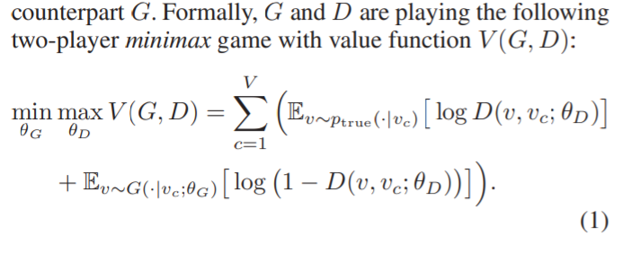
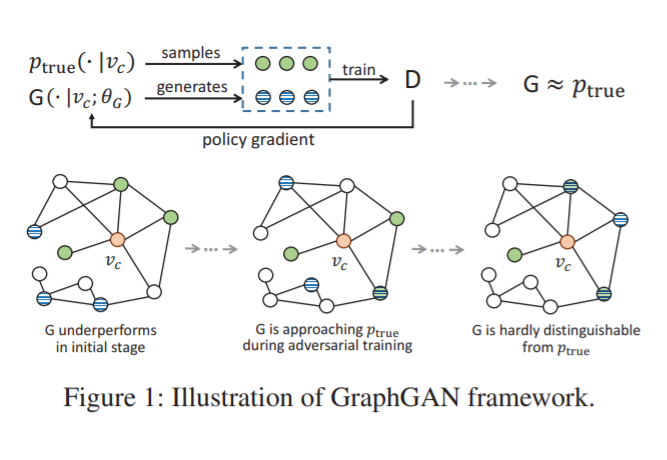
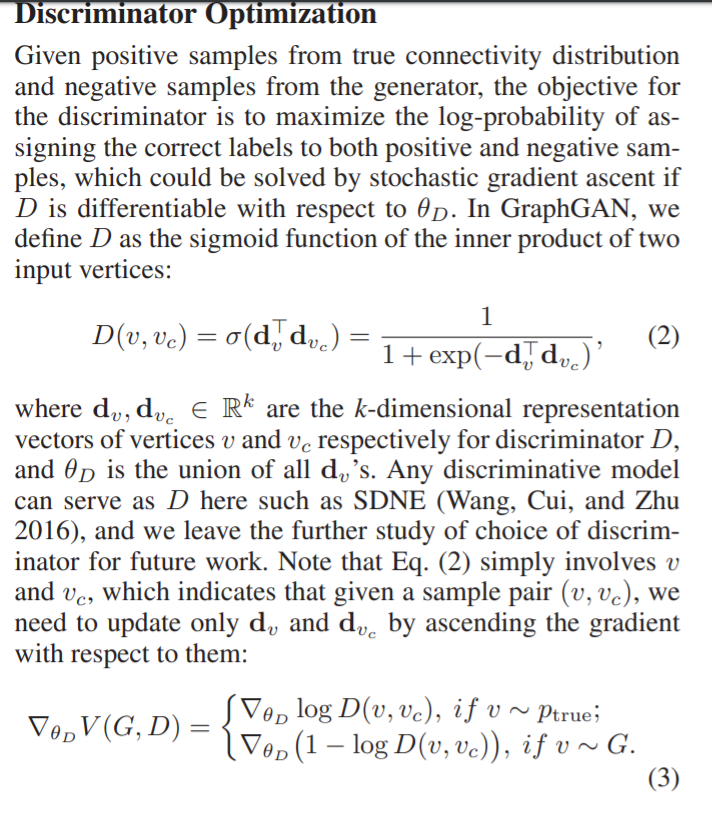
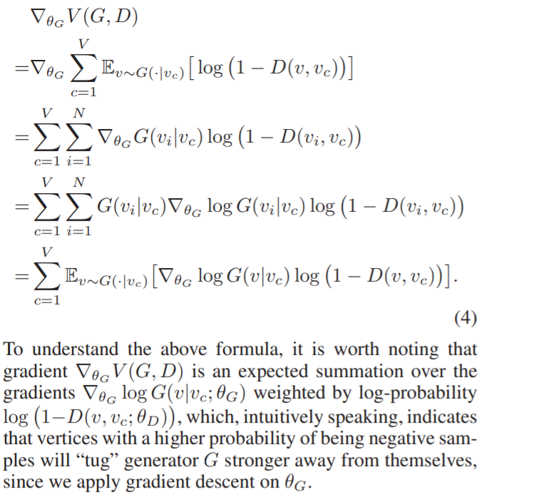
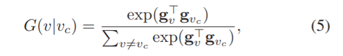
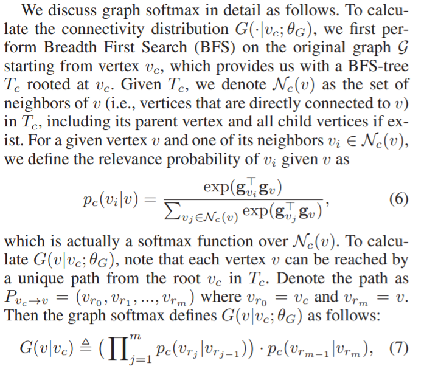
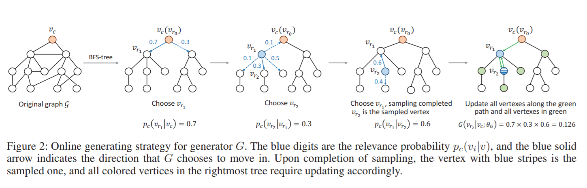
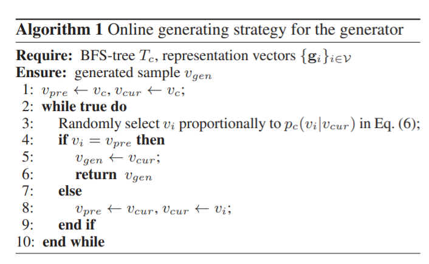
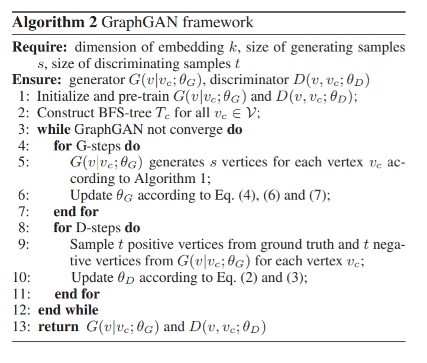

**Notes about my paper reading**

### Abstract

From the author's perspective, existing graph representation learning methods can be classified into two categories: generative models that learn the underlying connectivity distribution in the graph, and discriminative models that predict the probability of edge existence between a pair of vertices.

It proposes Graph-GAN to unify above 2 classes of methods, in which the generative model and discriminative model play a game-theoretical minimax game.

**Basic idea**: Specifically, for a given vertex, the generative model tries to fit its underlying true connectivity distribution over all other vertices and produces “fake” samples to fool the discriminative model, while the discriminative model tries to detect whether the sampled vertex is from ground truth or generated by the generative model. 

During the implementation of generative model, it proposes a novel graph softmax to overcome the limitations of traditional softmax function.

### Introduction

Generative graph representation learning model: for each vertex, there exists an underlying true connectivity distribution $p_{true}(v|v_c)$, which implies $v_c$'s connectivity preference over all other vertices in the graph. The edges in the graph can be viewed as observed samples generated by these conditional distributions. And these generative models learn vertex embeddings by maximizing the likelihood of edges in the graph. 

Discriminative graph representation learning model: It does not treat edges as generated from an underlying conditional distribution, but aims to learn a classifier for predicting the existence of edges directly. it considers two vertices $v_i$ and $v_j$ jointly as features, and predict the probability of an edge existing between the two vertices, $p(edge|(vi, vj )$.

### Graph generative adversarial nets

#### GraphGAN framework

GraphGAN: 

1. Generator $G(v|v_c)$, it tries to fit the underlying true connectivity distribution $p_{true}(v|v_c)$, and generates the most likely vertices to be connected with $v_c$.
2. Discriminator $D(v, v_c)$, which tries to distinguish well-connected vertex pairs from ill-connected ones, and calculates the probability of whether an edge exists between $v$ and $v_c$.

### Discriminator Optimization

### Generator Optimization

implementation of **G**:

but it is not good, due to it is a softmax function **over all other vertices**.

### Graph Softmax for Generator

 The key idea of graph softmax is to define a new method of computing connectivity distribution in generator $G(·|v_c; \theta_G)$ that satisfies the following three desirable properties: normalized, graph-structure-aware, computationally efficient.

### Generating strategy for generator G

 A feasible way of generating vertices is to calculate $G(v|v_c; \theta_G)$ for all vertices $v \neq vc$, and perform random sampling proportionally to their approximated connectivity probabilities. Here it proposes an online generating method, which is more computationally efficient and consistent with the definition of graph softmax.

It performs a random walk starting at the root $v_c$ in $T_c$ with respect to the transition probability defined in Eq. (6).

the framework:

